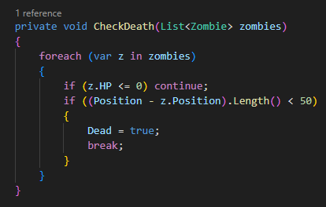
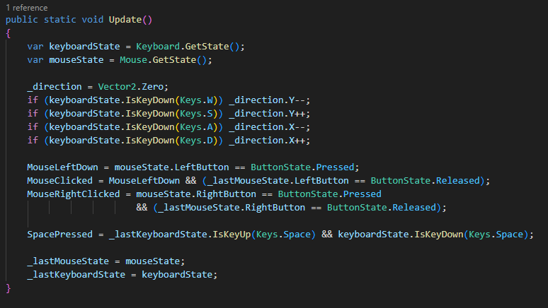
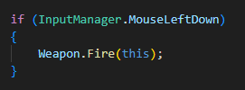
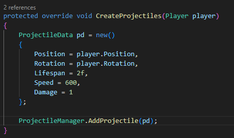
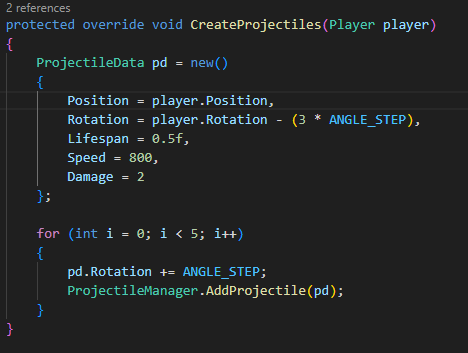
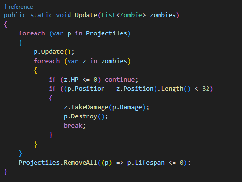
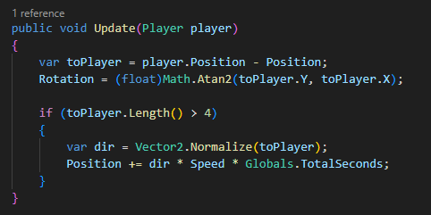
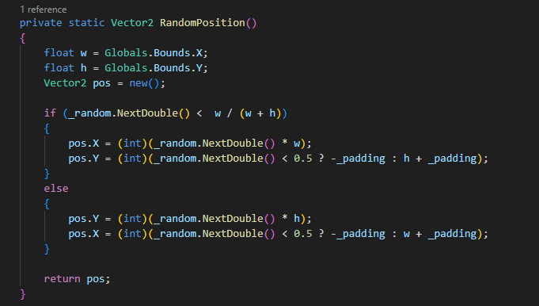
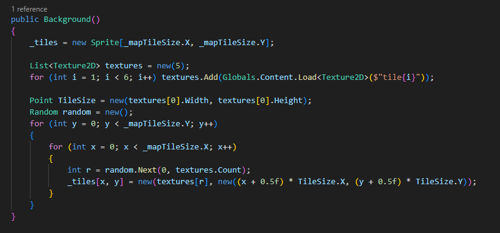
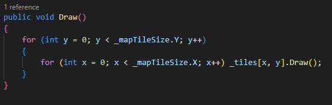

# Monogame---First-Project

Repositório Original :
 -> https://github.com/LubiiiCZ/DevQuickie/tree/master/Project002-TopDownShooter

 Grupo :
  -> Gonçalo Sousa // 22352
  _________________________________________________________________________________

  INDICE -

  1 - Descrição

  2 - Condição de Derrota

  3 - Movimentação do Jogador
  
  4 - Disparo de Projeteis

  5 - Movimentação dos Inimigos

  6 - Gerar Mapa
  _________________________________________________________________________________

  1 - Descrição : 

  O jogo é um Top-Down Shooter onde o jogador controla um personagem a partir de uma visão superior. O objetivo é sobreviver o máximo de tempo possível, eliminando inimigos que se aproximam com tiros.
  _________________________________________________________________________________

  2 - Condição de Derrota : 

  Neste jogo o jogador perde apenas quando colide com um inimigo. O jogador, controlado pela classe Player, deve evitar colidir com os inimigos que se aproximam. No ficheiro Player.cs, durante o método Update(), o jogo percorre todos os inimigos e verifica se algum colide com o jogador usando Intersects(). Se houver colisão, o jogo considera uma derrota do jogador.

  
  _________________________________________________________________________________

  3 - Movimento do Jogador : 

  No jogo, o movimento do jogador é feito através de entradas do teclado com constantes atualizações do estado.

  O jogador utiliza as teclas WASD para se movimentar:
   -> W: mover para cima.
   -> S: mover para baixo.
   -> A: mover para a esquerda.
   -> D: mover para a direita.

   Ainda também atualiza a posição do rato para o uso do disparo dos projeteis.

  _________________________________________________________________________________

  4 - Disparo de Projeteis

  O jogo possui um sistema de disparo com duas armas distintas, cada uma com características únicas:

    1 - Metralhadora (MachineGun.cs):
        
        - Cadência rápida (0.1s entre disparos)
        - 30 balas no carregador
        - Recarga em 2 segundos
        - Dispara um único projétil preciso na direção do cursor
        - Dano: 1 por projétil

    2 - Shotgun (Shotgun.cs)
        
        - Cadência lenta (0.75s entre disparos)
        - 8 balas no carregador
        - Recarga em 3 segundos
        - Dispara 5 projéteis em leque (abertura de 20 graus)
        - Dano: 2 por projétil (potencial total de 10 por disparo)

    3 - Gestão dos Projeteis

        A gestão de projetos é onde está a movimentação do projetil, o dano e onde o projetil desaparece quando sair da visão do jogador.

  _________________________________________________________________________________

  5 - Movimentação dos Inimigos

    Os inimigos (zumbis) possuem um comportamento de perseguição simples mas eficaz, implementado no ficheiro Zombie.cs:
      
      - Movem-se sempre na direção do jogador
      - Velocidade constante (100 unidades por segundo)
      - Deteção simples de proximidade (4 unidades de distância mínima)
      - Rotação do sprite para face ao jogador
  

    Padrão de Spawn:

      Os inimigos aparecem aleatoriamente nas bordas do mapa (implementado em ZombieManager.cs)

   _________________________________________________________________________________

  6 - Gerar Mapa

    O mapa é gerado aleatoriamente numa matriz 6x4 durante a inicialização do jogo. 
    
    A inicialização do mapa é feita da seguinte maneira:

      - Usa 5 tiles diferentes
      - Distribuição aleatória sem repetição padrão
      - Posicionamento centrado de cada tile

  Fluxo de Renderização: 
    
    - O GameManager chama _bg.Draw()
    - Cada tile é desenhado sequencialmente

